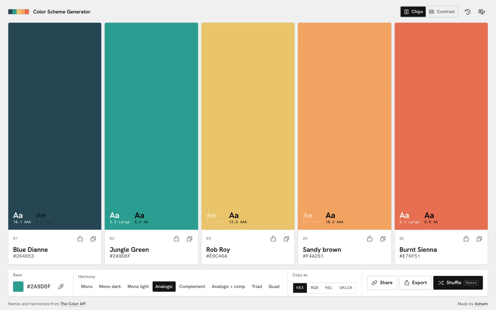
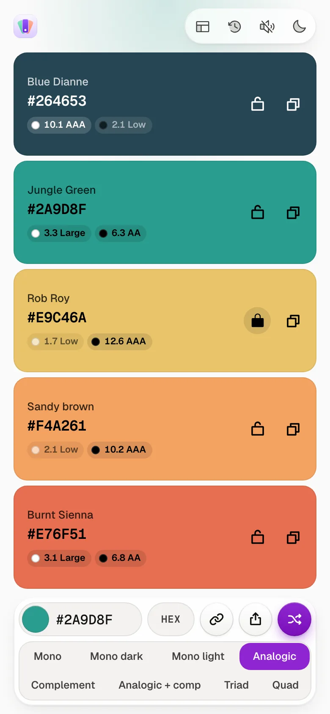
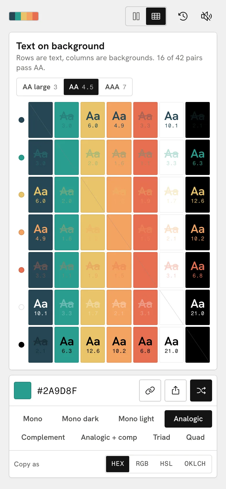
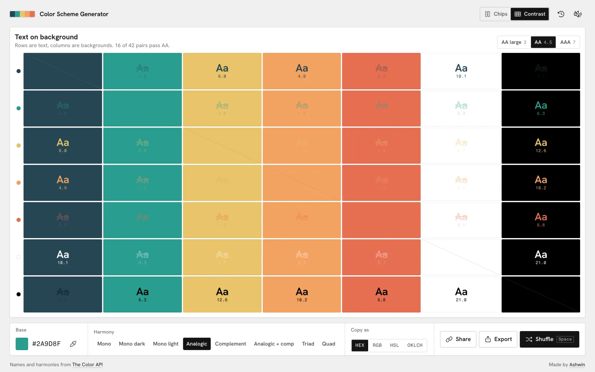
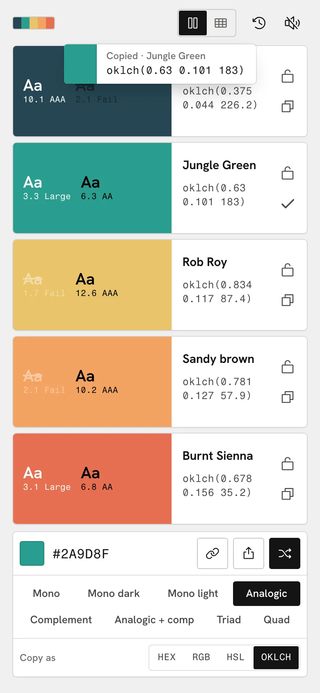
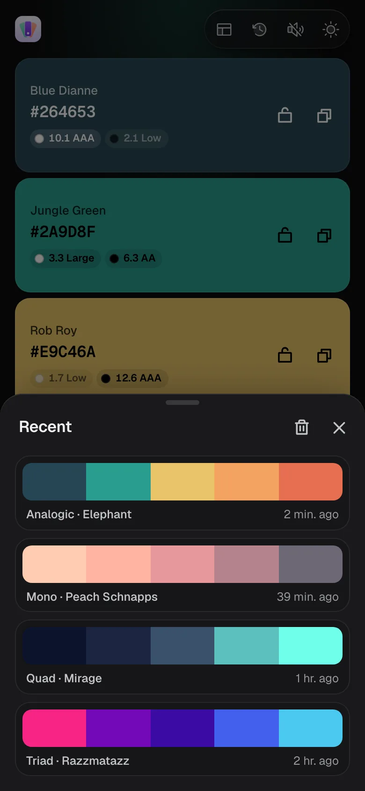
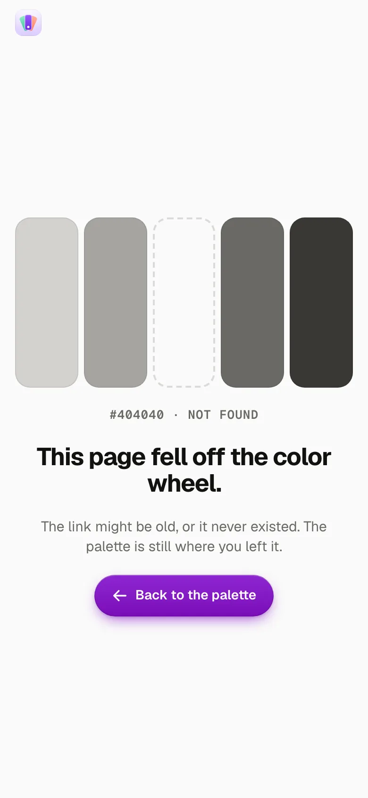

<p align="center">
  <a href="https://palette.ashwin.co.in">
    
  </a>
</p>

<p align="center">
  <a href="https://palette.ashwin.co.in"><strong>palette.ashwin.co.in</strong></a>
  &nbsp;·&nbsp;
  <a href="#what-it-does">what it does</a>
  &nbsp;·&nbsp;
  <a href="#one-request-five-colors">how it gets colors</a>
  &nbsp;·&nbsp;
  <a href="#running-it">running it</a>
</p>

<br>

<p align="center">
  
</p>

the source of **[palette.ashwin.co.in](https://palette.ashwin.co.in)**. pick one color, pick a harmony, and get five that work together. lock the ones you like, shuffle the rest, check how readable each one is, and take the lot away as css, tailwind, json or a png.

it is one html file, one stylesheet and seven small modules. no framework, no build step, no dependencies. the palettes and their names come from [the color api](https://www.thecolorapi.com/); everything else, the conversions, the contrast maths, the exports and the ui preview, happens in the browser.

## what it does

<p align="center">
  
  &nbsp;
  
  &nbsp;
  
</p>

- **live, not a button.** change the base color or the harmony and the palette follows. dragging the picker waits 260 ms after you stop before it asks the api, and a new request cancels the one in flight, so the last color you touched is the one you get.
- **all eight harmonies.** mono, mono dark, mono light, analogic, complement, analogic plus complement, triad and quad, in one segmented control. the old site only had seven.
- **lock and shuffle.** lock any swatch and it stays put while the others change. `space` shuffles to a random base and leaves locked swatches alone.
- **names on everything.** every color has a name from the api, even ones that came from a shared link or were mixed offline.
- **contrast on every swatch.** each one shows its wcag ratio against white and black, graded aaa, aa, large or low, and its own text flips to whichever reads better.
- **four formats.** hex, rgb, hsl or oklch. the format button changes what the swatches show, what a tap copies and what the exports write.
- **pick from the screen.** chrome and edge get an eyedropper next to the hex field.
- **export.** css custom properties, a tailwind v4 `@theme` block, json with every format, or a 1600 by 900 png. copy any of them or download the file.
- **ui preview.** one tap swaps the big swatches for a small strip and a mock card and chart painted with the palette, so you can see it on an actual interface before you commit.
- **share links.** the address bar always holds the current palette, and share copies it or opens the share sheet on phones. links from the old site, `?palette=...`, still open.
- **recent palettes.** the last 24 are kept on your device, a tap away.
- **undo.** `cmd` or `ctrl` + `z` steps back through shuffles, mode changes and restores.
- **keyboard.** `space` shuffles, `1` to `5` copy a swatch, `f` changes the format, `p` toggles the preview, arrows move through the harmonies.
- **sounds.** small synthesized ticks for copying, locking and shuffling, made with the web audio api. they wait for your first tap, stay quiet under the ios silent switch, and mute in one tap.
- **a 404 with a missing swatch**, and every view sets its own page title.
- **light and dark.** follows the system until you pick one, and switches with a crossfade.

## one request, five colors

a palette is a single call:

```
GET https://www.thecolorapi.com/scheme?hex=2A9D8F&mode=analogic&count=5
```

the api answers in about 0.7 to 1 s, has open cors and needs no key. i fired a dozen back to back calls at it and none were throttled, so live updates are fine as long as they are debounced.

- **locks are just slots.** a new scheme comes back as five colors. unlocked slots take the color at their index, locked slots keep theirs. nothing clever, and it never surprises you.
- **no flash while it thinks.** swatches keep their old colors until the new ones land, and only show a shimmer if the answer takes longer than 160 ms.
- **it still works when the api doesn't.** if a request fails, the same harmony is mixed locally in hsl and a toast offers a retry. those colors have no names until the api is back.
- **names get filled in.** colors that arrive without a name, from a link or from history, are looked up with `/id?hex=` and cached for the session.
- **the api is not always right.** anything whose nearest named color is pure blue comes back called "unmellow yellow". that one is patched to "blue".

## the maths is local

the api gives hex, rgb, hsl and cmyk, but not oklch or contrast, so [`js/color.js`](js/color.js) does both.

- **oklch** goes srgb to linear light to oklab to polar, with the matrices from [björn ottosson's post](https://bottosson.github.io/posts/oklab/). it is also what the ui preview uses to decide which color is the lightest, the darkest and the most colorful.
- **contrast** is the wcag 2 formula, straight from relative luminance, so the numbers match any contrast checker.
- **token names** in the exports come from the color names, with accents stripped and duplicates numbered, so two "electric violet"s become `electric-violet` and `electric-violet-2`.

## the design

- **the palette is the page.** the swatches take the whole screen, and everything else lives in one glass dock at the bottom and one capsule at the top.
- **it borrows your colors.** the soft glow at the top of the page is tinted by whatever base color you pick.
- **one screen, every screen.** from a 320 px iphone se to a 2560 px monitor, portrait or landscape, the whole app fits without scrolling. container queries drop the name and the contrast chips when a swatch gets too short, and long oklch values shrink or wrap rather than get cut off.
- **nothing jumps.** geist and geist mono are self-hosted and preloaded with metric-matched fallbacks, the harmony picker is in the html rather than built by script, and layout shift measures 0.
- **motion that stays out of the way.** colors crossfade with a small stagger, the harmony highlight slides with a clip-path, sheets drag down to dismiss on phones, and reduced motion swaps it all for plain fades.
- **one accent.** the violet comes from the old site's share button.

## the stack

| layer | choices |
| --- | --- |
| markup and style | plain html and css, with oklch tokens, container queries and `:has()` |
| script | seven es modules in [`js/`](js), loaded straight by the browser |
| motion | css transitions and the web animations api |
| data | [the color api](https://www.thecolorapi.com/) for schemes and names |
| icons | [phosphor](https://phosphoricons.com), inlined as an svg sprite |
| hosting | [vercel](https://vercel.com/), as static files |

## running it

there is nothing to install. the modules need to be served rather than opened as a file, so any static server works:

```sh
git clone https://github.com/Ashwin-S-Nambiar/Color-Scheme-Generator.git
cd Color-Scheme-Generator
python3 -m http.server 5173   # or: npx serve
```

then open http://localhost:5173.

## the shape of it

```
index.html      the page, the icon sprite and both sheets
index.css       tokens, themes, then every component, in one file
404.html        the missing swatch
js/
  main.js       state, rendering, the dock, sheets, keyboard and the preview
  api.js        the color api client and the name cache
  color.js      conversions, contrast, the offline mixer and token names
  exporters.js  css, tailwind, json and png
  sheet.js      the export and recent sheets, with drag to dismiss
  sound.js      web audio ticks
  store.js      localStorage, history and haptics
fonts/          geist and geist mono, latin and latin-ext
```

## known rough edges

- **five colors, always.** the api can return more, but the layout is built around five.
- **the eyedropper is chromium only.** safari and firefox don't have the api yet, so the button hides there.
- **copying the png** needs a browser that lets pages write images to the clipboard. download always works.

<details>
<summary><strong>more screenshots</strong></summary>

<br>




<p align="center">
  
  &nbsp;
  
  &nbsp;
  
</p>

</details>

<br>

<div align="center">

**Made with ❤️ by [Ashwin S Nambiar](https://github.com/Ashwin-S-Nambiar)**

</div>
