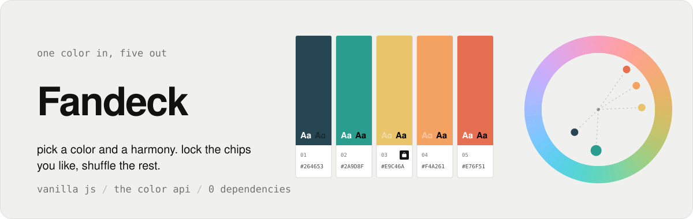
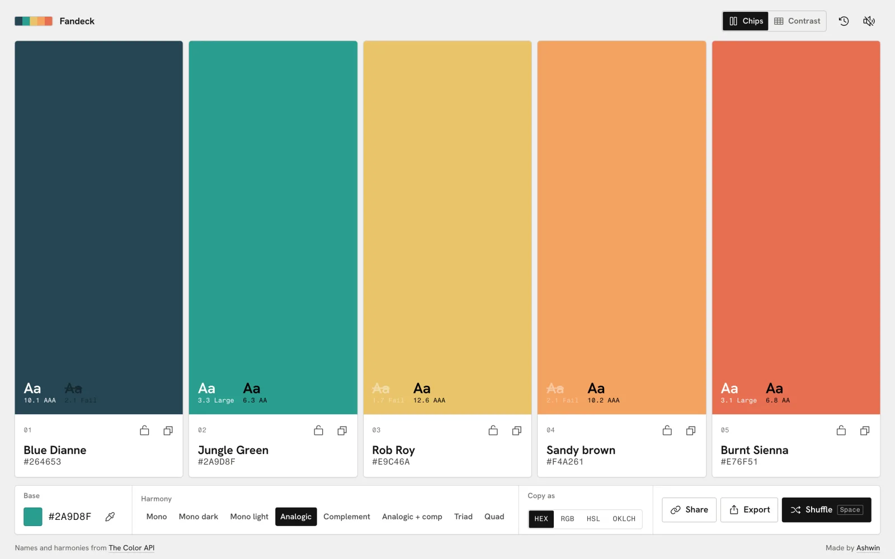
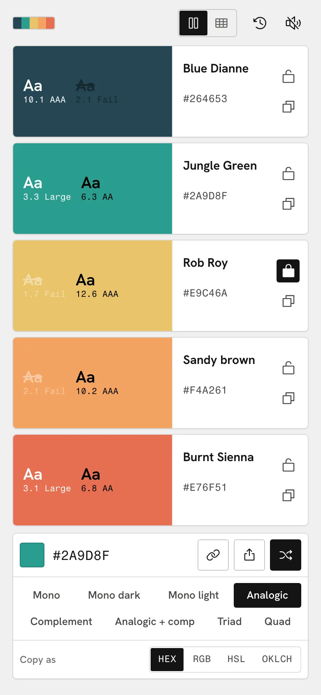
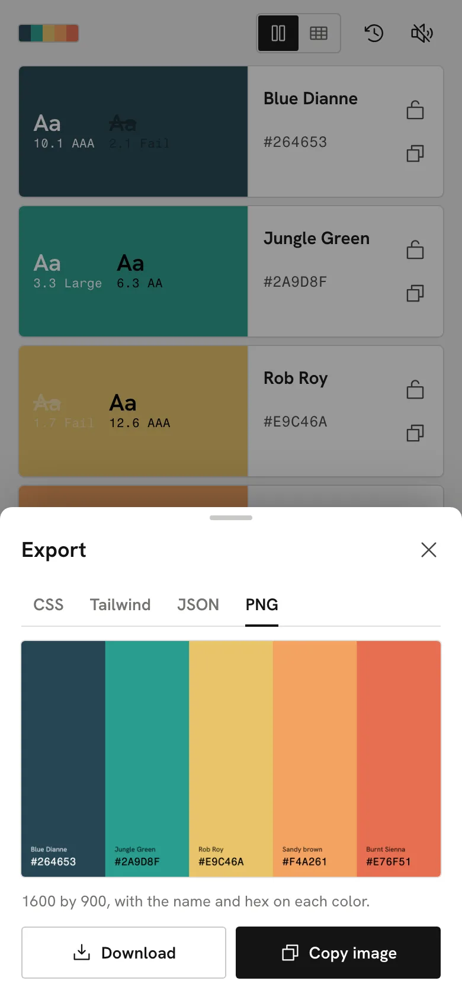
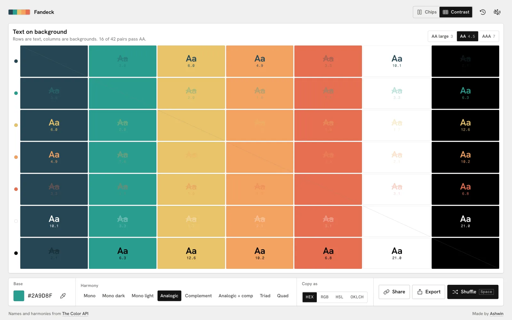
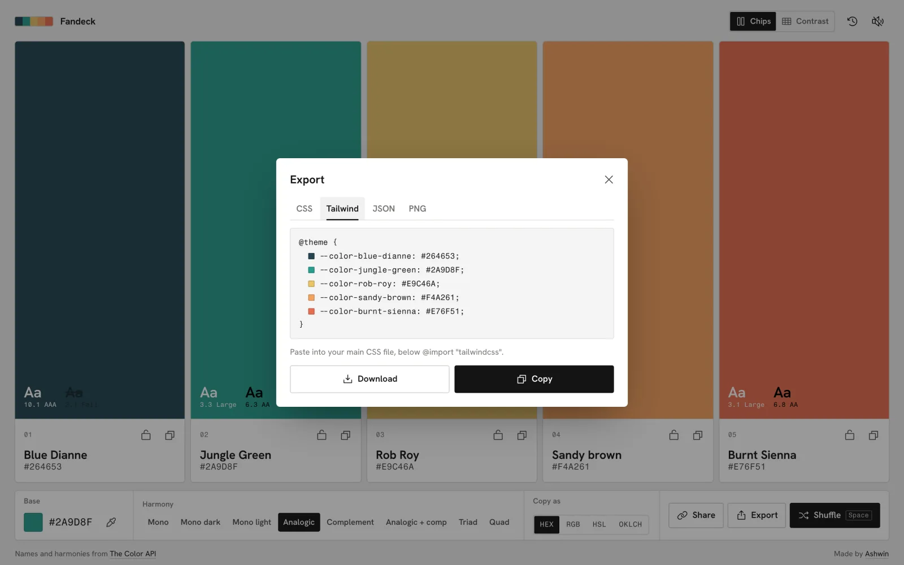
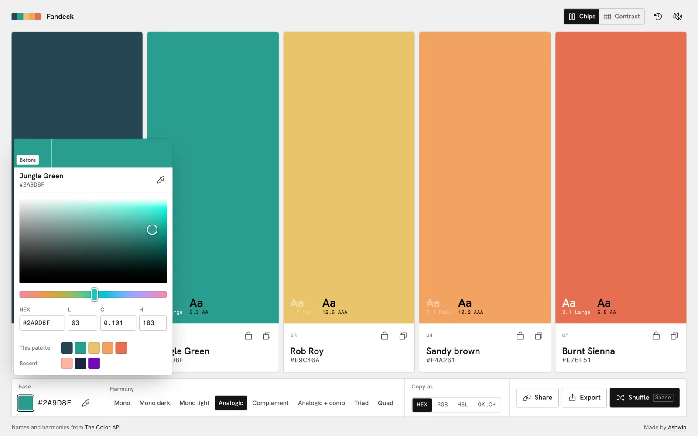
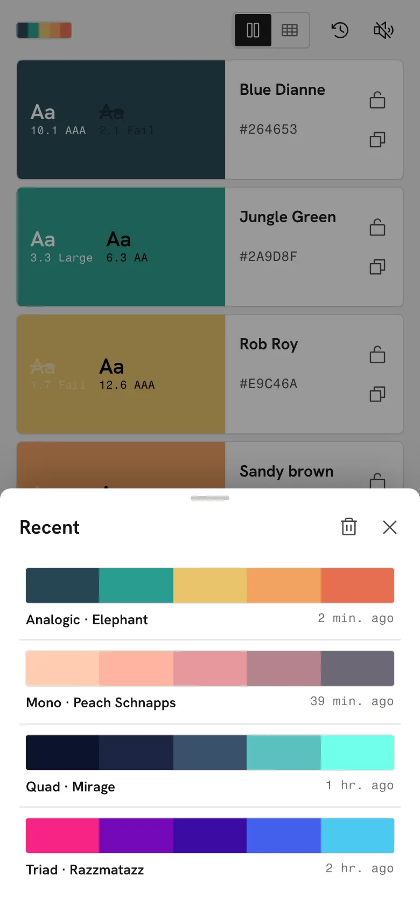
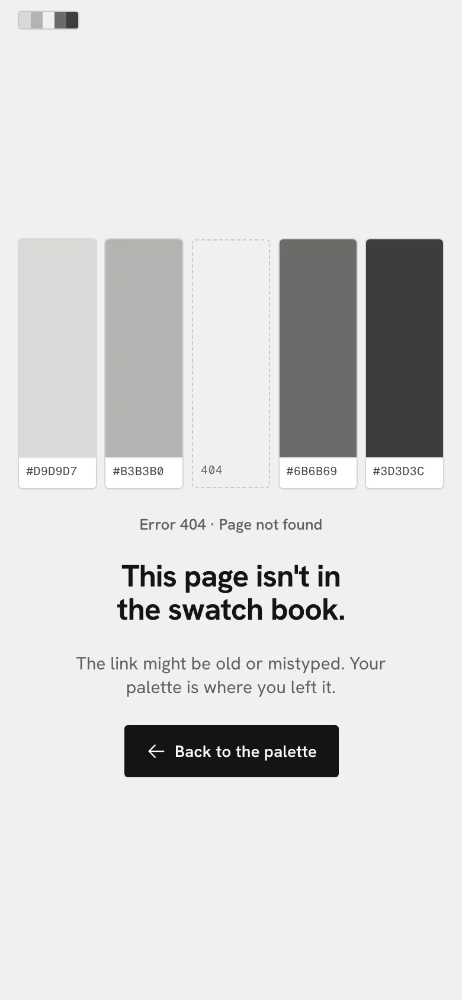

<p align="center">
  <a href="https://fandeck.ashwin.co.in">
    
  </a>
</p>

<p align="center">
  <a href="https://fandeck.ashwin.co.in"><strong>fandeck.ashwin.co.in</strong></a>
  &nbsp;·&nbsp;
  <a href="#what-it-does">what it does</a>
  &nbsp;·&nbsp;
  <a href="#one-request-five-colors">how it gets colors</a>
  &nbsp;·&nbsp;
  <a href="#running-it">running it</a>
</p>

<br>

<p align="center">
  
</p>

the source of **[fandeck.ashwin.co.in](https://fandeck.ashwin.co.in)**, named after the fan of paint chips you flip through in a paint store. pick one color, pick a harmony, and get five that work together. lock the ones you like, shuffle the rest, check which pairs are readable, and take the lot away as css, tailwind, json or a png.

it is one html file, one stylesheet and eight small modules. no framework, no build step, no dependencies. the palettes and their names come from [the color api](https://www.thecolorapi.com/); everything else, the conversions, the contrast maths and the exports, happens in the browser.

## what it does

<p align="center">
  
  &nbsp;
  
  &nbsp;
  
</p>

- **live, not a button.** change the base color or the harmony and the palette follows. dragging the picker waits 260 ms after you stop before it asks the api, and a new request cancels the one in flight, so the last color you touched is the one you get.
- **all eight harmonies.** mono, mono dark, mono light, analogic, complement, analogic plus complement, triad and quad, all visible at once. the old site only had seven.
- **lock and shuffle.** lock any chip and it stays put while the others change. `space` shuffles to a random base and leaves locked chips alone.
- **names on everything.** every color has a name from the api, even ones that came from a shared link or were mixed offline.
- **text samples on every chip.** instead of a badge, each chip shows real white and black "Aa" on the color with its wcag ratio. a pair that fails is struck through.
- **four formats.** hex, rgb, hsl or oklch, picked under copy as. it changes what the chips show, what a tap copies and what the exports write.
- **a picker made for this.** the base swatch opens a picker instead of the browser's own: a lightness by chroma square in oklch, where every row runs from grey to the most saturated color a screen can show at that lightness, so the square is always full and you can never pick outside the gamut. a hue strip, hex, l, c and h fields, a before and after chip that puts your old color back in one tap, the live color name, this palette and your recent bases as one tap picks, and the eyedropper in chrome and edge. the palette follows as you drag.
- **export.** css custom properties, a tailwind v4 `@theme` block, json with every format, or a 1600 by 900 png. copy any of them or download the file.
- **every pair, checked.** the contrast view puts each color, plus white and black, as text on every other one: 42 pairs with their ratios, one row per text color. pick aa large, aa or aaa and the pairs that miss fade out. tap a pair to copy it as `color` and `background-color`.
- **share links.** the address bar always holds the current palette, and share copies it or opens the share sheet on phones. links from the old site, `?palette=...`, still open.
- **recent palettes.** the last 24 are kept on your device, a tap away.
- **undo.** `cmd` or `ctrl` + `z` steps back through shuffles, mode changes and restores.
- **keyboard.** `space` shuffles, `1` to `5` copy a chip (the number on its label), `p` switches between chips and contrast, arrows move through any group.
- **sounds.** small synthesized ticks for copying, locking and shuffling, made with the web audio api. they wait for your first tap, stay quiet under the ios silent switch, and mute in one tap.
- **a 404 with a missing chip**, and every view sets its own page title.
- **light only, on purpose.** a dark theme adds nothing to a color tool, so there is no toggle. the page is a neutral paper grey, which is the fairest background to judge color against.

## one request, five colors

a palette is a single call:

```
GET https://www.thecolorapi.com/scheme?hex=2A9D8F&mode=analogic&count=5
```

the api answers in about 0.7 to 1 s, has open cors and needs no key. i fired a dozen back to back calls at it and none were throttled, so live updates are fine as long as they are debounced.

- **locks are just slots.** a new scheme comes back as five colors. unlocked slots take the color at their index, locked slots keep theirs. nothing clever, and it never surprises you.
- **no flash while it thinks.** chips keep their old colors until the new ones land, and only show a shimmer if the answer takes longer than 160 ms.
- **it still works when the api doesn't.** if a request fails, the same harmony is mixed locally in hsl and a toast offers a retry. those colors have no names until the api is back.
- **names get filled in.** colors that arrive without a name, from a link or from history, are looked up with `/id?hex=` and cached for the session.
- **the api is not always right.** anything whose nearest named color is pure blue comes back called "unmellow yellow". that one is patched to "blue".

## the maths is local

the api gives hex, rgb, hsl and cmyk, but not oklch or contrast, so [`js/color.js`](js/color.js) does both.

- **oklch** goes srgb to linear light to oklab to polar, with the matrices from [björn ottosson's post](https://bottosson.github.io/posts/oklab/). it is one of the four copy formats.
- **contrast** is the wcag 2 formula, straight from relative luminance, so the numbers match any contrast checker.
- **token names** in the exports come from the color names, with accents stripped and duplicates numbered, so two "electric violet"s become `electric-violet` and `electric-violet-2`.

## the design

it is laid out like a paint chip, because that is what a palette is when it is not on a screen.

- **no accent color.** color is judged against neutral grey, so the interface has none of its own. everything is white, grey and ink, active controls are solid black, and the only color on the page is yours.
- **the chip.** a field of color on top, a white label underneath with a number, a name and a value, so text always sits on white instead of fighting the color. on phones the chip turns sideways into a row.
- **type.** hanken grotesk for names and labels, and fragment mono for every color value. fragment mono is drawn from helvetica, the face printed on real pantone chips.
- **flat and ruled.** 3 px corners, one pixel rules between the sections of the control bar, and quiet sentence case labels for base, harmony and copy as. no gradients, no blur, no glow, no shouty caps.
- **one hover, everywhere.** anything you can click gets the same faint fill when the pointer is over it, and colors get a thin ring instead. tooltips only show up where an icon could be misread, like the lock, and never on touch.
- **toasts are chips too.** a copied color shows up as a little chip: the color on the left, the value on a white label beside it.
- **one screen, every screen.** from a 320 px iphone se to a 2560 px monitor, portrait or landscape, the whole app fits without scrolling. container queries shrink a chip's label as the chip gets shorter, down to just a hex and a lock on a landscape phone, and long oklch values wrap rather than get cut off.
- **nothing jumps.** the fonts are self-hosted and preloaded with metric-matched fallbacks, the harmony picker is in the html rather than built by script, and layout shift measures 0.
- **motion that stays out of the way.** colors crossfade with a small stagger, the harmony highlight slides with a clip-path, sheets drag down to dismiss on phones, and reduced motion swaps it all for plain fades.

## the stack

| layer | choices |
| --- | --- |
| markup and style | plain html and css, with container queries and `:has()` |
| script | eight es modules in [`js/`](js), loaded straight by the browser |
| motion | css transitions and the web animations api |
| data | [the color api](https://www.thecolorapi.com/) for schemes and names |
| type | [hanken grotesk](https://fonts.google.com/specimen/Hanken+Grotesk) and [fragment mono](https://fonts.google.com/specimen/Fragment+Mono), self-hosted |
| icons | [phosphor](https://phosphoricons.com), regular weight, inlined as an svg sprite |
| hosting | [vercel](https://vercel.com/), as static files |

## running it

there is nothing to install. the modules need to be served rather than opened as a file, so any static server works:

```sh
git clone https://github.com/Ashwin-S-Nambiar/Fandeck.git
cd Fandeck
python3 -m http.server 5173   # or: npx serve
```

then open http://localhost:5173.

## the shape of it

```
index.html      the page, the icon sprite and both sheets
index.css       tokens, themes, then every component, in one file
404.html        the missing chip
js/
  main.js       state, chips, the contrast grid, the bar, sheets and keyboard
  picker.js     the base color picker: oklch square, hue strip, fields and quick picks
  api.js        the color api client and the name cache
  color.js      conversions, contrast, the offline mixer and token names
  exporters.js  css, tailwind, json and png
  sheet.js      the export and recent sheets, with drag to dismiss
  sound.js      web audio ticks
  store.js      localStorage, history and haptics
fonts/          hanken grotesk and fragment mono, latin and latin-ext
```

## known rough edges

- **five colors, always.** the api can return more, but the layout is built around five.
- **the eyedropper is chromium only.** safari and firefox don't have the api yet, so the button hides there. the picker itself works everywhere.
- **copying the png** needs a browser that lets pages write images to the clipboard. download always works.

<details>
<summary><strong>more screenshots</strong></summary>

<br>







<p align="center">
  
  &nbsp;
  
  &nbsp;
  
</p>

</details>

## credit

palettes and color names come from [the color api](https://www.thecolorapi.com/), which is [open source](https://github.com/andjosh/thecolorapi).

---

[fandeck.ashwin.co.in](https://fandeck.ashwin.co.in) · [ashwin.co.in](https://ashwin.co.in) · [notes](https://notes.ashwin.co.in) · [x](https://x.com/ashwinnambiar11) · [github](https://github.com/Ashwin-S-Nambiar)
